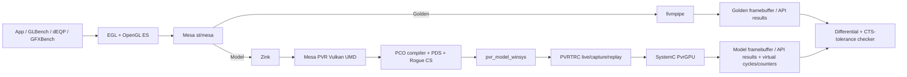
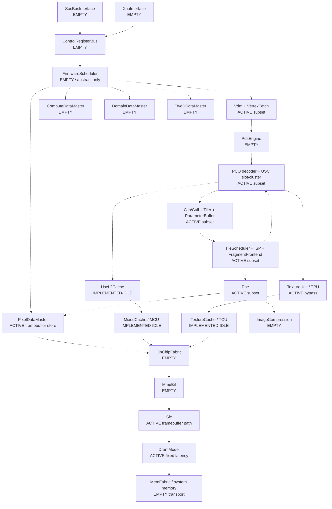
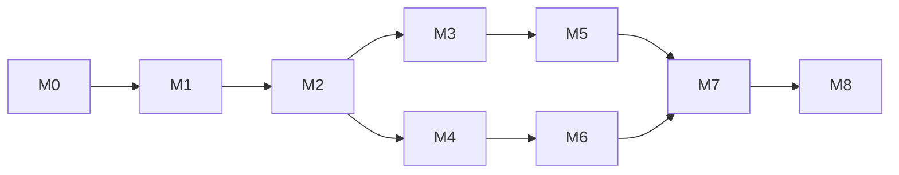

# PvrGPU：以 SystemC 建立 PowerVR 功能與效能模型的實作計畫

> 文件版本：0.7  
> 公開資料盤點截止日：2026-08-29  
> 狀態：可執行的基線計畫；所有未由公開資料證實的數值均須參數化並標示來源，不得包裝成 PowerVR 事實。
> DXTP 對照來源：使用者提供的 `IMG DXTP.md` First Draft；只作 inactive structural cross-reference，不列入公開證據基線。

## 1. 執行摘要與關鍵決策

PvrGPU 的目標是建立一個可由真實 OpenGL ES 應用驅動的 SystemC GPU 模型，同時支援：

1. **功能驗證**：比較渲染結果、API 狀態、同步與查詢結果。
2. **效能評估**：輸出模型 GPU cycles、預測 frame time、各單元忙碌率、stall 與記憶體流量；SystemC 在主機上的執行速度不等於 GPU 效能。
3. **架構探索**：以可追蹤來源的參數調整 USC、TPU、tile、cache、SLC、DRAM 與併行度，量化敏感度。

本計畫採以下基線：

- 第一個可執行硬體 profile 定為 **IMG BXS-4-64、BVNC 36.53.104.796**。Mesa 公開程式碼已有這個 profile，且現行公開 PowerVR Vulkan driver 的可執行路徑以 Rogue 為主；不可把所有 B-Series、Rogue、Volcanic 視為同一架構。[BXS-4-64 profile](https://gitlab.freedesktop.org/mesa/mesa/-/blob/4d02806659f20c17c1f96e17547fa789a2afed3c/src/imagination/common/device_info/bxs-4-64.h)、[Imagination 多架構路線說明](https://blog.imaginationtech.com/scaling-the-open-source-powervr-vulkan-driver-to-new-gpu-architectures)
- 正式模型路徑定為：

  ```text
  App
    → EGL / OpenGL ES
    → Mesa st/mesa
    → Zink
    → Mesa PowerVR Vulkan UMD（PVR compiler、PDS、command streams）
    → pvr_model_winsys / PVRTRC
    → SystemC PvrGPU
  ```

  2026 年公開 PowerVR driver 已說明 Linux kernel 6.16+ 與 Zink/OpenGL ES 支援，因此這條路徑能最大化重用公開的 PCO compiler、PDS 與 Rogue command-stream 定義。[PowerVR Open Source GPU Driver](https://developer.imaginationtech.com/solutions/open-source-gpu-driver/)、[Zink/OpenGL ES 公開說明](https://blog.imaginationtech.com/powervr-the-path-to-open-source-zink-and-opengl-es-support)
- 功能 Golden 路徑定為：

  ```text
  同一 App / 測項 / seed / EGL config / Mesa commit
    → EGL / OpenGL ES
    → Mesa
    → llvmpipe
  ```

- **llvmpipe 是 differential oracle，不是 OpenGL ES 規範本身，也不是效能 Golden。** 最終規範依據是 Khronos OpenGL ES/GLSL ES 規範與 dEQP/CTS；涉及浮點精度、derivative、MSAA sample position 或 implementation-dependent 行為時，不可要求與 llvmpipe 位元完全相同。[OpenGL ES Registry](https://registry.khronos.org/OpenGL/index_es.php)、[Mesa llvmpipe](https://docs.mesa3d.org/drivers/llvmpipe.html)
- [附圖 IMG_0415.jpeg](./IMG_0415.jpeg) 只作為**非規範性的邏輯架構框架**。圖中的 MATMUL、ASTC、PVRIC、CXS、多核心堆疊等標籤，不能單憑圖片推論 BXS-4-64 一定存在或具有某個吞吐率；各 block 必須由 profile 與公開證據啟用。
- [IMG DXTP.md](./IMG%20DXTP.md) 是使用者提供、標示為 First Draft、但未附公開 URL/hash 的 D-Series DXTP-64-2048 架構對照資料。它可用來建立 block 名稱與缺口矩陣，但**不是本文件的公開證據來源，也不是 BXS product profile**。本模型目前只把其 cache capacity/line/bank 數值選作 `pvrgpu-ref-v1` 的 project/reference configuration；未公開的 associativity、replacement 與 DRAM latency 明確標成 assumed uArch，不能轉述為 PowerVR 硬體事實。其餘 USC/ISP 數量、VA、memory-channel 與 throughput 仍是 `inactive/reference-only`。
- SystemC 核心採**純 event-driven** 架構：module 間一律使用有界 FIFO 傳遞小型 transaction/handle；大量資料存放於共享 memory pool，FIFO 不複製 framebuffer、texture、shader 或 tile payload；模型不建立全域 `sc_clock`、不使用 `SC_CTHREAD`，也不逐 cycle tick。
- 在沒有實際 BXS 硬體、PVRTune trace、可信 RTL 或廠商校準資料前，成果只能宣稱為**公開資料導向的 architecture/performance estimate**，不得宣稱產品級 cycle accuracy 或可直接重現商用 GPU FPS。

### 1.1 已落地的第一個垂直切片

截至 2026-08-29，本 workspace 已能執行以下路徑：

```text
ChromeOS GLBench（20 cases）
  → EGL / OpenGL ES
  → counter-enabled Mesa 26.2.1
  → llvmpipe
  → per-frame Report.md + framebuffer PNG
  → Qt PvrGPU Control counter table/chart/image/log

內建 GLBench Fill.Solid state-case fixture（尚未經過 Mesa command ingest）
  → event-driven PvrGPU SystemC functional slice
  → 32×32 Tiler / ISP / PBE
  → PixelDataMaster → SLC → fixed-latency DRAM backing/readback
  → modeled counters + DRAM-readback RGBA framebuffer PNG
  → Qt PvrGPU Control counter table/chart/image/log
```

- `scripts/run-path-smoke.sh` 驗證真實 renderer string、counter report 與 PNG。
- `scripts/run-pvrgpu-control.sh` 啟動 Qt/PySide6 控制台，能選 backend、case、sample、surface size，並啟停獨立 runner。
- iCloud workspace 只保存 source/documentation；venv、CMake/Ninja build、Mesa/GLBench checkout、runtime output、log 與 temporary files 統一放在 `$PVRGPU_WORK_ROOT`，預設為 `$HOME/Downloads/_Codex/Working/PvrGPU`，可用 `PVRGPU_WORK_ROOT` 改址。
- 現行 llvmpipe report 包含 14 個 Gallium pipeline statistics，加上 `drawlists`、`setup_triangles`、`texel_fetches` 三個本地 telemetry extension；UI 標示為 `REP · llvmpipe`，不宣稱硬體 cycles/cache/bandwidth。
- `pvrgpu-model-stub` 已實作 **`fill_solid`、`fill_solid_depth_never`、`fill_solid_depth_neq` function-correct slice**，以內建 GLBench command fixture實際執行 `VDM → VertexFetch → vertex PCO decode/USC ISS → ClipCull → Tiler → ParameterBuffer → fragment PCO decode → TileScheduler → ISP/HSR/depth → FragmentFrontend → USC ISS → TPU bypass → PBE → PixelDataMaster → SLC → DramModel → JsonReporter`。PBE 只產生 pre-memory RGBA；PNG writer 只能讀 `DramModel` backing 所建立的新 readback handle，不能直接讀 PBE payload。module 連線使用 bounded FIFO，bulk shader/primitive/tile/fragment/framebuffer data 均留在 generation-checked `MemoryPool`。Counter 標示 `modeled` / `MOD · PvrGPU`，timing 仍為 assumed/uncalibrated。
- Cache 採常見的 bank-interleaved set-associative、write-back、write-allocate、true LRU：MCU/TCU 各 24 KiB、64 B line、4-way/4-bank；SLC 2 MiB、128 B line、8-way/8-bank；USC-L2 8 KiB、64 B line、4-way/1-bank。容量/line/bank來自 DXTP reference，way/policy 是本模型選定的 uArch 假設。`cache_bypass=false`（UI 顯示 Off）是預設並啟用 cache；`true` 只略過 lookup/allocation以加速模擬，仍強制走 DRAM backing/readback。
- Shader 已不再使用 `ShaderProgram` enum 或固定紅色 branch。Submitter 放入 Mesa 26.2.1 commit `da14d65e4499e66468094be52bff9ea0915a695e` 產生的真實 PCO bytes；`PcoDecoder` 嚴格解析 instruction group，`UscCluster` 透過 ISS 執行 raw register bits，PBE 才把 F32 `PIXOUT0..3` 轉成 RGBA8。第一版 exact subset 是 Fill.Solid 所需的 `MBYP`、`UVSW.write`、`UVSW.write.emit.endtask`、source/ISS/destination/repeat/end/padding；未知 encoding 一律 fail closed。
- 每個 counter frame 同時輸出 per-DrawList 的 VS/FS `program` 靜態組成與 `executed` 動態 ALU/Tex/Memory 總量；後者按 PCO repeat 展開後乘以 shader invocations，不能與靜態 `pco_instructions` 混用。Memory 類別包含 `UVSW` export，單位是 instructions 而非 bytes。
- ISP 不再以 coverage union mask 當正式介面。24.8-style fixed-point top-left rule 保證兩個 triangle 的 shared edge 只有一個 coverage owner；ordered tile primitive references、primitive identity、barycentric/depth 與每個 fragment 的 PIXOUT 一路保存到 PBE。通用回歸條件是 `fragment_candidates == ps_invocations + hsr_rejected_fragments`；Depth Never 在 ISP 將所有 candidate 拒絕，合法地形成 zero-fragment-work，PBE 再從明確 clear-color state resolve 黑色 RGBA8 framebuffer。
- 目前 functional slice 的 tile 是使用者指定的 **32×32 模型規格**，provenance 是 project requirement，不是公開 BXS 資料的硬體 claim；未支援的 GLBench case 必須 fail closed。
- 真正的 `GLBench → Mesa → pvrgpu → SystemC` 仍需分開連結的 `glbench-pvrgpu`/Mesa driver 或一個同時包含 `llvmpipe,pvrgpu` 的 Mesa prefix。UI 與 counter schema 已預留，替換 producer 不需重做畫面。

### 1.2 Tested Summary（2026-08-29）

測試採嚴格 stop-on-first-error gate：同一 case/size 先跑 pinned GLBench → Mesa 26.2.1 → llvmpipe，再跑 PvrGPU；依序驗證 renderer、process/protocol、MemoryPool leak、counter conservation，以及**解碼後 RGBA8 每個 pixel/channel**。PNG 壓縮 bytes 或檔案 SHA 不要求相同。任一 gate 失敗時停止該序列，保存兩邊 log/PNG/counter，先由 GLBench、Mesa state tracker 與 llvmpipe source debug，不進下一 case。

Golden matrix 固定 GLBench commit `e99bc684272bffd68b06c998e272531c9c84330f`、Mesa commit `da14d65e4499e66468094be52bff9ea0915a695e`、llvmpipe renderer `LLVM 22.1.8, 256 bits`、RGBA8/D24S8、sample=1、64×64。完整 20-case evidence 位於：

`$PVRGPU_WORK_ROOT/golden/glbench-llvmpipe-64x64/Report.md`

| Bring-up order | GLBench case | llvmpipe Golden 64×64 | PvrGPU differential | 關鍵驗證 / 下一個 gate |
|---:|---|---|---|---|
| 1 | `fill_solid` | PASS；PS=4096；全紅 | **PASS**；64×64、33×35 RGBA exact | 真實 PCO VS/FS、top-left、32×32 tiles、每 pixel 一次 FS |
| 2 | `fill_solid_depth_never` | PASS；PS=0；全黑 | **PASS**；64×64、33×35 RGBA exact | 33×35：covered/tested/rejected=1155、PS/FS dynamic=0、depth writes=0 |
| 3 | `fill_solid_depth_neq` | PASS；PS=4096；全紅 | **PASS**；64×64、33×35 RGBA exact | 33×35：window-z=0.5、tested/written=1155、rejected=0、FS ALU=4620 |
| 4 | `fill_solid_blended` | PASS；PS=4096；全紅 | PENDING | 必須做 ordered translucent path 與 PBE `SRC_ALPHA/ONE_MINUS_SRC_ALPHA` RMW；不可用 alpha=1 overwrite shortcut |
| 5 | `triangle_setup` | PASS；setup=8970 | PENDING | indexed draw、large mesh、orange/green coverage |
| 6 | `triangle_setup_all_culled` | PASS；PS=0、setup=5456 | PENDING | CW/BACK face cull、全綠 clear |
| 7 | `triangle_setup_half_culled` | PASS；PS=2044、setup=6797 | PENDING | deterministic host-bound winding pattern |
| 8 | `attribute_fetch_shader` | PASS；setup=8192、PS=0 | PENDING | 1 attribute；PNG 只見 clear，必須驗 VS fetch trace/counter |
| 9 | `attribute_fetch_shader_2_attr` | PASS；setup=8192、PS=0 | PENDING | 2 attribute sum；需 fetch/VS counter |
| 10 | `attribute_fetch_shader_4_attr` | PASS；setup=8192、PS=0 | PENDING | 4 attribute sum；需 fetch/VS counter |
| 11 | `attribute_fetch_shader_8_attr` | PASS；setup=8192、PS=0 | PENDING | 8 attribute sum；需 fetch/VS counter |
| 12 | `varyings_shader_1` | PASS；PS=4096、gradient | PENDING | 1 varying、perspective interpolation |
| 13 | `varyings_shader_2` | PASS；PS=4096、同 gradient | PENDING | 2 varying sum，不能只靠相同 PNG |
| 14 | `varyings_shader_4` | PASS；PS=4096、同 gradient | PENDING | 4 varying sum與parameter traffic |
| 15 | `varyings_shader_8` | PASS；PS=4096、同 gradient | PENDING | 8 varying sum與parameter traffic |
| 16 | `fill_tex_nearest` | PASS；PS=4096、texel fetches=4352 | PENDING / fail-closed | varying、LOD0 nearest、texture memory path |
| 17 | `fill_tex_bilinear` | PASS；PS=4096、texel fetches=17408 | PENDING | bilinear 4-tap；需非 texel-aligned size |
| 18 | `fill_tex_trilinear_linear_01` | PASS；PS=3600、fetches=32640 | PENDING | derivative/LOD、兩 mip bilinear + lerp |
| 19 | `fill_tex_trilinear_linear_04` | PASS；PS=2304、fetches=19968 | PENDING | derivative/LOD、scaled coverage |
| 20 | `fill_tex_trilinear_linear_05` | PASS；PS=2116、fetches=19904 | PENDING | derivative/LOD≈0.5 sensitivity |

`PASS` 只標在該欄實際完成的證據上；llvmpipe Golden PASS 不代表 PvrGPU 已支援。三個已支援 case 可用以下 stop-on-error 指令重跑：

本次 cache/DRAM gate 另行通過：33 個 SystemC module class 的 one-module/one-`.h/.cpp` layout、完整 C++ build、7/7 CTest 與 iCloud source-tree guard；CTest 包含 `CacheArray` policy/data unit及 MCU/TCU/USC-L2 FIFO/event controller unit。33×35 RGBA8 的 4620 bytes 會形成 37 條 SLC line：cache active 第一幀為 37 misses、第二幀為 37 hits，每幀 37 dirty writebacks；DRAM physical write 為 4736 bytes、final bulk readback 為 4620 bytes。另以相同 Fill.Solid case驗證 `cache_bypass=on` 時 cache lookup counter為 0、DRAM write/read仍各 1 transaction，且兩種模式解碼後 PNG RGBA逐 byte相同。MemoryPool terminal gate仍為 allocations==releases、bytes-in-flight==0。

Qt/QProcess offscreen smoke 亦為 5/5 PASS：llvmpipe、PvrGPU Fill.Solid cache off、PvrGPU Fill.Solid cache on、Depth Never off、Depth Not Equal off；96×96 Fill.Solid off/on PNG 為 0 differing pixels、max channel delta 0，且 UI counter table可顯示 PixelDM/SLC/DRAM新增欄位。

目前 33 個 module class 中，16 個位於 active Fill.Solid pipeline、3 個是已實作但尚未有 active workload traffic 的 cache controller、12 個仍是空 structural placeholder，另有 2 個 harness；不能把 idle cache controller或空 placeholder算成 benchmark feature coverage。

```bash
./scripts/run-glbench-differential.sh fill_solid 64x64
./scripts/run-glbench-differential.sh fill_solid_depth_never 64x64
./scripts/run-glbench-differential.sh fill_solid_depth_neq 64x64
```

下一個尚未通過的 gate 固定為 `fill_solid_blended`。在 alpha=1 GLBench differential 之外，必須先增加 alpha=0.5 與兩個重疊半透明 primitive 的 ordered blend unit/integration probes；未通過前不進 triangle、varying 或 texture。

### 1.3 PvrGPU Reference uArch v1

使用者已決定：公開資料沒有揭露的內部 microarchitecture 採一組明確假設持續往下，不等待未知硬體資訊。實作集中在 `src/systemc/common/reference_uarch.h`，並以 `pvrgpu-ref-v1` / `uarch_provenance=assumed` 對外標記；功能語意仍依 Khronos/Mesa 公開 encoding，不因效能假設而改變。

目前固定值為：

| 項目 | Reference v1 | 性質 |
|---|---:|---|
| Tile | 32×32 | project specification / assumed uArch |
| Subpixel | 8 fractional bits | assumed engineering precision |
| Sample | 1×，pixel center | current supported state |
| USC issue | 4 lanes | assumed uArch |
| Fragment group | spatial 2×2 quad | functional grouping + assumed scheduling |
| Module FIFO depth | 4 | assumed uArch |
| Module service base/batch latency | 集中於同一 config | assumed、尚未校準 |
| MCU / TCU | 24 KiB、64 B line、4-way、4 banks | capacity/line/bank：DXTP reference；way/policy：assumed |
| SLC | 2 MiB、128 B line、8-way、8 banks | capacity/line/bank：DXTP reference；way/policy：assumed |
| USC internal L2 | 8 KiB、64 B line、4-way、1 bank | capacity/line：DXTP reference；way/bank/policy：assumed |
| Cache policy | bank-interleaved、write-back、write-allocate、true LRU | selected common uArch assumption |
| DRAM latency | fixed 1 cycle / request | user-selected functional/performance-model assumption |
| Cache bypass default | `off` / JSON `false` | full cache enabled；`on`仍經 DRAM |

這組設定會一路用於 GLBench bring-up；未來若有實機量測，只新增 calibration/profile version，不改 shader binary、primitive identity、tile list、fragment work 或 MemoryPool/FIFO 合約。

操作與驗證指令見 [README.md](./README.md)，counter adapter 合約見 [docs/COUNTER_PROTOCOL.md](./docs/COUNTER_PROTOCOL.md)。

## 2. 目標、範圍與不做事項

### 2.1 目標

- 從簡單 smoke test 一路執行到 GLBench、dEQP 與 GFXBench。
- 接收 Mesa 實際產生的 PowerVR USC binary、PDS 程式與 command streams，而非另造一套與 driver 無關的虛構 ISA。
- 正確建模 TBDR 的 geometry/tiling 與 per-tile fragment 階段，以及其間的 parameter buffer、texture、cache、MMU/SLC 與外部記憶體互動。
- 將「功能語意」和「timing/資源限制」分層，使功能除錯不受尚未校準的 latency 影響。
- 每一個硬體數值都能追溯為 `published`、`source-derived`、`measured`、`fitted` 或 `assumed`。
- 支援 live execution、capture/replay、參數 sweep、回歸測試及 counter 對照。

### 2.2 第一版支援範圍

- Linux x86-64 host、headless EGL surfaceless/pbuffer。
- 單一 BXS-4-64 profile、單 GPU context 起步，再擴充多 context。
- OpenGL ES 2.0 → 3.0 → 3.1 的逐步 enablement；只 advertise 已實作且通過對應 CTS 的 capability。
- graphics 為優先；compute、atomics、SSBO/image 與 ES 3.2 視 benchmark 需求後續加入。
- 功能模型先單核心；多核心/CXS 在單核心模型與校準穩定後才啟用。

### 2.3 明確不做事項

- 不逆向或聲稱掌握未公開韌體、PVRIC、cache policy、排程器或完整 ISA 細節。
- 不以 llvmpipe 的 CPU 執行時間作 GPU 效能基準。
- 不以 SystemC host wall-clock FPS 作預測 FPS；正式數值只能由 virtual cycles / 設定時脈換算。
- 不在 MVP 模擬實際 firmware processor ISA。Firmware 先以 job/DM 排程與 event 的抽象模型呈現。
- 不以 `sc_clock`、clock-edge process 或每 cycle polling 推進模型；即使輸出 cycle-equivalent counter，也只在 transaction 到達、資源釋放或工作完成時喚醒。
- 不承諾 Android、Wayland、X11、KMS、dma-buf 或顯示掃描輸出；它們是平台整合階段，不應阻塞 core model。
- 不把附圖或 marketing throughput 當成未經 profile 驗證的 microarchitecture 規格。

## 3. 公開證據基線與可追溯政策

### 3.1 證據優先序

| 等級 | 資料類別 | 用法 |
|---|---|---|
| A | Khronos 規範/CTS、IEEE/Accellera SystemC、Linux UAPI | API、同步、介面與合規的規範性依據 |
| B | 固定 commit 的 Mesa、Linux KMD 公開原始碼 | 實際 driver 支援的 profile、binary encoding、command layout 與提交介面 |
| C | Imagination 公開架構、ISA、register、PVRTune 文件 | 架構意圖、block 關係、counter 與可公開行為 |
| D | 實機 counter、microbenchmark、可信 RTL | latency、throughput、queue/cache 與 arbitration 校準 |
| E | 推導或假設 | 只可作 sensitivity range；必須顯式標記，不能當作已知事實 |

若資料互相衝突，API correctness 以 A 為準；該 Mesa build 的實際 encoding/介面以 B 為準；微架構描述以對應世代與 profile 的 C 為準。所有衝突都要進入 decision log，不可悄悄選值。

### 3.2 版本鎖定

目前可執行 PCO fixture 使用 Mesa 26.2.1 commit `da14d65e4499e66468094be52bff9ea0915a695e`；較早研究連結中的 commit `4d02806659f20c17c1f96e17547fa789a2afed3c` 只保留作歷史資料定位，不得與可執行 binary provenance 混用。現行 PCO binary/hash/來源已鎖在 `third_party/mesa-pco.lock`；完整 release manifest 至少還需記錄：

- Mesa commit、build options、compiler 版本與 patch set。
- Linux kernel/KMD commit、PowerVR firmware binary hash（若使用）。
- VK-GL-CTS release/commit、GLBench commit、GFXBench commit 與資產版本。
- SystemC、CMake、LLVM/Clang/GCC、Python 與容器 image digest。
- 每份 vendor 文件的 URL、版本/日期、SHA-256、適用世代與使用到的 claim。

「以所有公開資料為基礎」在工程上定義為：維護一份**有截止日、版本、來源、適用範圍與 hash 的可審計資料庫**，每次 major release 前重新盤點；不是宣稱網路上沒有遺漏任何資料。

### 3.3 第一個 profile 的已知與未知

Mesa 的 BXS-4-64 公開 profile 可提供 16×16 tile、512-bit SLC cache line、單 cluster、單 raster pipe、USC/PDS/TPU 的若干容量與並行設定，這些可作為 source-derived 參考；它們只適用該 BVNC。目前 functional slice 依使用者指定採用 32×32 tile，這是本模型的 project specification，不是從 BXS header 推導，也不得宣稱公開資料支持 32×32。[Mesa BXS-4-64 device info](https://gitlab.freedesktop.org/mesa/mesa/-/blob/4d02806659f20c17c1f96e17547fa789a2afed3c/src/imagination/common/device_info/bxs-4-64.h)

以下資訊目前公開來源不足，必須保留為未知、範圍或校準參數：

- 各 BVNC 的 USC/TPU/PDS/ISP/PBE 真實 latency、throughput、pipeline depth 與 hazard/errata。
- DM/job queue depth、仲裁、context preemption 與 firmware scheduling policy。
- MCU/TCU/SLC 的容量、associativity、replacement、MSHR、prefetch、banking 與一致性細節。
- HSR/tag 的完整實作、PVRIC encoding 與壓縮 metadata/延遲。
- PDS/USC 未被公開 compiler 使用的指令、模式及邊界行為。
- MATMUL、CXS、ASTC 等 block 在特定 profile 的存在性和吞吐率；必須同時通過 device-info、driver capability 與測試證據才能啟用。

Imagination 公開 register ZIP 包含 firmware/KM driver interface 所引用的 CDM、VDM、ISP、PBE、PDS、TPU、USC、MMU/BIF、SLC、event、reset、clock、IRQ 與 performance register 子集；它不是完整 datasheet。[Rogue public register documents](https://developer.imaginationtech.com/wp-content/uploads/2023/12/rogue-registers-description-docs.zip)

### 3.4 Profile 與 provenance 邊界

DXTP 結構對齊不改變目前可執行模型的 profile。三個 layer 必須分開：

| Layer | Profile / source | Provenance | Active in executable | 可用範圍 |
|---|---|---|---|---|
| Driver / binary baseline | BXS-4-64 + pinned Mesa | public source-derived | **是** | command/shader encoding 與可執行 functional bring-up |
| Functional/timing assumption | `pvrgpu-ref-v1` | project-specified / assumed | **是** | 32×32 tile、FIFO depth=4、logical issue/service parameters；非產品規格 |
| Structural cross-reference | DXTP-64-2048 `IMG DXTP.md` | user-supplied First Draft、未附公開 source locator | **否** | block naming、hierarchy gap analysis；數值不得套入 active profile |

因此目前的兩個 stage-specific `UscCluster` instance 是 VS/FS logical execution instances，不代表 DXTP 的實體 USC 數量；單一 `Isp` 也是 functional abstraction，不代表 DXTP topology。`MemoryPool` 則是 simulator payload storage，不是 USC store、MCU/TCU、SLC、DRAM 或硬體 zero-copy memory。

## 4. 端到端軟體架構



### 4.1 為何選 Zink → PVR UMD → model winsys

Mesa 已有公開的 PowerVR Vulkan driver、PCO compiler、PDS encoder 與 Rogue control-stream XML；model winsys 可在 BO/VM/context/job-submit/fence 的邊界攔接完整 PVR 工作，而不需重做 EGL、OpenGL ES state tracker 或一套自創 command processor。[Mesa PowerVR driver](https://docs.mesa3d.org/drivers/powervr.html)、[Zink](https://docs.mesa3d.org/drivers/zink.html)

三個方案的決策如下：

| 方案 | 決策 | 理由 |
|---|---|---|
| Zink → PVR Vulkan UMD → model winsys | **正式主線** | 最大量重用真實公開 PVR shader/compiler/job/control stream，最符合功能與效能模型目的 |
| Mesa Gallium `pvrmodel` driver | 備援/診斷路徑 | bring-up 較直接，但會重做 PVR fixed-function、descriptor/job glue，容易與真實 UMD 漂移 |
| 修改 llvmpipe，由 CPU 畫圖、SystemC 只估 timing | 僅 Phase-0 shadow mode | 可快速產生刺激，但不能驗證 PVR ISA、tiling、texture/cache 的功能 |

Mesa internal ABI 不保證跨版本穩定，因此 `pvr_model_winsys` 與 UMD 必須在同一個固定 Mesa source tree 內編譯，不做對任意 system Mesa 的 binary plugin。

### 4.2 model winsys 合約

在 [PVR winsys interface](https://gitlab.freedesktop.org/mesa/mesa/-/blob/4d02806659f20c17c1f96e17547fa789a2afed3c/src/imagination/vulkan/winsys/pvr_winsys.h) 實作 `pvr_model_winsys`：

- BO：allocate/import/map/unmap/free，保存 CPU backing 與 model GPU virtual address。
- VM：reserve/map/unmap，交由 SystemC MMU/BIF 模型做 address translation 與 fault 檢查。
- Context：render/compute/transfer context、priority、timeline 與隔離資訊。
- Submit：將 geometry、fragment、compute、transfer/null job 及其 wait/signal sync 送入模型。
- Fence：只有功能副作用完成且 virtual completion time 到達後才能 signal。
- Query：API observable 結果由功能模型產生；GPU timestamp/time-elapsed 使用 virtual time，不能回傳主機執行時間。

Linux PowerVR UAPI 已公開 BO、VM、context、sync 以及 geometry、fragment、compute、transfer job 類型，可作合約交叉檢查，但模型不必假裝成真實 DRM device。[Linux PowerVR UAPI](https://docs.kernel.org/gpu/imagination/uapi.html)

### 4.3 Live 與 capture/replay

建立 versioned `PVRTRC`，而不是依賴不完整或不穩定的臨時 log。每個 trace 至少包含：

- schema version、Mesa commit、BVNC、capability hash、endianness、model config hash。
- BO 建立/銷毀、VA mapping、initial data 與 page/region delta。
- context、job type、command stream、wait/signal timeline、提交順序。
- shader NIR hash、PCO dump、USC binary、PDS data/code、compiler stats。
- 預期 readback/query 及可重現 seed；大型資源採內容尋址與去重。

執行模式：

1. **Live functional**：App 經 winsys 將工作送入單一 simulator worker；SystemC 產生 framebuffer/query/fence 結果。
2. **Capture**：一次執行 App 取得完整 PVRTRC。
3. **Offline functional replay**：用於 deterministic regression 與 first-failure debug。
4. **Offline timing replay**：不重跑 App，快速進行 fidelity、cache、clock、bandwidth 與架構 sweep。

初期可同 process 整合，但只能由單一 worker 呼叫 SystemC kernel；介面穩定後改成 `pvr-modeld` daemon，以隔離 crash、支援大規模 replay 與避免 Mesa 多執行緒直接進入 kernel。

## 5. IMG_0415 與 DXTP reference 對齊的 SystemC 架構

本節同時保留「目標 topology」與「目前真正會跑的連線」，兩者不可混用。下圖是由公開 PowerVR 架構框架、`IMG_0415.jpeg` 與使用者提供的 `IMG DXTP.md` 建立的 **target/reference topology**；虛線代表 planned relation，不表示現在已有 FIFO、protocol、cache traffic 或功能。

### 5.1 Target/reference topology（不是目前 executable wiring）



此 topology 只表達 model boundary。`XPU` 不自行等同舊圖的 `CXS`；`Pbe` 不等同 Pixel Data Master；`PcoDecoder` 也不等同 PDS。MMU、cache 與 fabric 的最終 request ordering 必須等公開 profile/driver 行為與 transaction contract 定案後才能固定。

### 5.2 DXTP block → SystemC 對齊矩陣

狀態定義：

- `ACTIVE-FUNCTIONAL`：目前三個 Fill.Solid/depth state cases 真的會執行該 module 與功能 subset。
- `ACTIVE-BYPASS`：module 位於 executable chain，但目前 case 沒有對應工作，且會拒絕不支援的 request。
- `IMPLEMENTED-IDLE`：已有 FIFO port、cache array、event-driven process 與 unit/smoke 驗證，但現行 workload 尚未送入對應 traffic；不可算 active feature coverage。
- `EMPTY-PLACEHOLDER`：class、獨立 `.h/.cpp`、CMake 與 top-level elaboration 已存在；沒有 ports/process/timing/functional connection。
- `REFERENCE-ONLY`：只保留在架構 ledger，不製造沒有可驗證責任的 module。
- `HARNESS`：驗證/輸入輸出工具，不是 GPU 硬體 block。

| DXTP / 架構元素 | PvrGPU class 或 composite | 目前狀態 | 精確限制 |
|---|---|---|---|
| SoC Bus Interface | `SocBusInterface` | `EMPTY-PLACEHOLDER` | 沒有 AXI、MMIO、burst、outstanding 或 ordering 行為；`Submitter` 不是 SoCIF |
| XPU Interface | `XpuInterface` | `EMPTY-PLACEHOLDER` | 只保留 block boundary；不臆造 XPU 名稱展開或 protocol，也不等同 CXS |
| Control and Register Bus | `ControlRegisterBus` | `EMPTY-PLACEHOLDER` | 尚無 register map、kick、event、IRQ 或 performance-register transport |
| Firmware Processor | `FirmwareScheduler` | `EMPTY-PLACEHOLDER` | 未來只做抽象 job/DM scheduler；不宣稱執行 RISC-V firmware ISA |
| Vertex Data Master | `Vdm`、`VertexFetch` | `ACTIVE-FUNCTIONAL` subset | 只接受內建 GLBench fixture，不是完整 command/data-master implementation |
| Pixel Data Master | `PixelDataMaster` | `ACTIVE-FUNCTIONAL` subset | 驗證 PBE RGBA store、指定 framebuffer GPU address，經 `MemoryTxn` FIFO 送往 SLC |
| Compute Data Master | `ComputeDataMaster` | `EMPTY-PLACEHOLDER` | 現行 graphics slice 沒有 compute dispatch |
| Domain Data Master | `DomainDataMaster` | `EMPTY-PLACEHOLDER` | 名稱來自 DXTP attachment；domain protocol/semantics 尚未公開驗證 |
| 2D Data Master | `TwoDDataMaster` | `EMPTY-PLACEHOLDER` | 尚無 blit/2D render-packet ingest |
| Programmable Data Sequencer | `PdsEngine` | `EMPTY-PLACEHOLDER` | 沒有 PDS decode/execute/task generation；USC `PcoDecoder` 不能代替 PDS |
| Unified Shading Cluster | `PcoDecoder` + `UscSlot` + `UscCluster` + non-module `pco_iss` | `ACTIVE-FUNCTIONAL` subset | VS/FS logical instances、最小 public PCO subset；不是 8-USC physical topology |
| Texture Processing Unit | `TextureUnit` | `ACTIVE-BYPASS` | Fill.Solid 明確為零 texture request；sampling/LOD/filter/format 尚未實作 |
| Geometry Phase Pipeline | VDM、vertex fetch/USC、`ClipCull`、`Tiler`、`ParameterBuffer` composite | `ACTIVE-FUNCTIONAL` subset | functional grouping，不臆稱每個 class 都是一個 DXTP physical block |
| Fragment Phase Pipeline | fragment USC、`TileScheduler`、`Isp`、`FragmentFrontend`、`TextureUnit`、`Pbe` composite | `ACTIVE-FUNCTIONAL` subset | fill/depth/HSR subset；單一 logical ISP 不代表 8-ISP topology |
| USC internal L2 | `UscL2Cache` | `IMPLEMENTED-IDLE` | 8 KiB／64 B line／4-way／1 bank controller 已可處理 synthetic `MemoryTxn`；USC active load/store response 尚未接線 |
| Mixed Cache Unit | `MixedCache` | `IMPLEMENTED-IDLE` | 24 KiB／64 B line／4-way／4-bank array 與 controller 已實作；現行 VS/FS 尚未產生 generic/code traffic |
| Texture Cache Unit | `TextureCache` | `IMPLEMENTED-IDLE` | 24 KiB／64 B line／4-way／4-bank array 與 controller 已實作；Fill.Solid 的 texture request 為 0 |
| MMU / bus interface | `MmuBif` | `EMPTY-PLACEHOLDER` | 無 VA translation、TLB/page cache、protection、fault 或 request FIFO |
| System Level Cache | `Slc` + non-module `CacheArray` | `ACTIVE-FUNCTIONAL` framebuffer subset | 2 MiB／128 B line／8-way／8 banks；真實 tag/data、WB/WA、LRU、dirty flush/writeback；與 USC internal L2 分開 |
| DRAM | `DramModel` | `ACTIVE-FUNCTIONAL` framebuffer subset | module 自有 backing；每 request fixed latency=1；cache active 為 line writes、bypass 為 bulk write，兩者都做獨立 bulk readback |
| On-chip / system-memory transport | `OnChipFabric`、`MemFabric` | `EMPTY-PLACEHOLDER` | 尚無 routing/arbitration/channel/bandwidth；framebuffer slice 目前以 PDM→SLC→DRAM direct FIFO bypass 這兩個 transport placeholder |
| IMGIC / PVRIC image compression | `ImageCompression` | `EMPTY-PLACEHOLDER` | PBE 目前輸出 uncompressed RGBA8；沒有 codec、metadata 或壓縮率模型 |
| PVRGC geometry compression | 無 | `REFERENCE-ONLY / MISSING` | 未有可執行 contract；不把 parameter buffer 當成 compression engine |
| SPU / Jones / SPARROW / CHEST、power islands | 無 | `REFERENCE-ONLY` | 屬 physical/power hierarchy；不為目前 functional slice 製造空 forwarding hierarchy |
| On-chip performance/power/stat registers | `ControlRegisterBus` 僅預留 boundary | `EMPTY-PLACEHOLDER` | `JsonReporter` 是 `HARNESS` observer，不是硬體 performance register block |

#### 5.2.1 已選定的 cache reference uArch

`IMG DXTP.md` 對 capacity/line/bank 並非「未知」；其數值已用作本 project 的 reference configuration。未知的是現行 **BXS executable profile** 的完整容量／policy，以及 DXTP 未列的 associativity、replacement、MSHR、latency、arbitration 等欄位。為了沿同一組 uArch 往 benchmark 方向實作，本版選定常見的 set-associative、write-back、write-allocate、true-LRU policy；這是 `assumed`，不是從 attachment 或公開 PowerVR 資料推導。

| Cache / store | DXTP attachment reference | 與目前 SystemC 的關係 |
|---|---|---|
| USC internal L2 | 8 KiB；64 B line；4-way；1 bank | `UscL2Cache` + `CacheArray` 已實作；現行 workload traffic idle |
| MCU L1 | 24 KiB；64 B line；4-way；4 banks | `MixedCache` + `CacheArray` 已實作；現行 workload traffic idle |
| TCU | 24 KiB；64 B line；4-way；4 banks | `TextureCache` + `CacheArray` 已實作；現行 workload traffic idle |
| SLC | 2 MiB；128 B line；8-way；8 banks | `Slc` active 承接 framebuffer store 與 dirty writeback |

`CacheArray` 保存實際 line bytes，不只計算 hit/miss；full-line store miss 可直接 write-allocate，dirty victim/flush callback 會深拷貝成 `DramLineWrite` MemoryPool records。Forced flush 只清 dirty、不 invalidate resident line，因此跨 frame 可觀察 cold miss→warm hit。尚未實作 MSHR、prefetch/coherence、bank conflict、fabric contention 或 read-response；相關 counter 仍不可宣稱完成。

目前 layout checker 為 **PASS（33 個 SystemC module class）**：16 個 active GPU functional class、3 個 implemented-idle cache class、2 個 harness class、12 個空 placeholder class。VS/FS 各自實例化 `PcoDecoder`、`UscSlot`、`UscCluster`，top-level 共有 21 個 executable-chain instance、3 個 implemented-idle cache instance 與 12 個 placeholder instance。所有具體 module 仍遵守一個 class 對一組唯一同 stem `.h/.cpp`。

### 5.3 目前真正的 executable FIFO / MemoryPool chain

```text
Submitter                                      [HARNESS]
  → Vdm → VertexFetch
  → PcoDecoder(VS) → UscSlot(VS) → UscCluster(VS)
  → ClipCull → Tiler → ParameterBuffer
  → PcoDecoder(FS) → TileScheduler → Isp → FragmentFrontend
  → UscSlot(FS) → UscCluster(FS)
  → TextureUnit                                [ACTIVE-BYPASS]
  → Pbe
  → PixelDataMaster
  → Slc                                       [cache active by default]
  → DramModel                                 [fixed 1 cycle / request]
  → JsonReporter                               [HARNESS]
```

這是 20 條 depth=4 的 active bounded FIFO：geometry/fragment 及 PBE/DRAM completion 使用 `sc_fifo<PipelineTxn>`；PixelDataMaster→SLC→DramModel 使用 `sc_fifo<MemoryTxn>`，只帶 state/payload handle、address、bytes、operation/client/format。raw PCO、decoded instruction、vertex、primitive、tile list、fragment candidate/output 與 framebuffer bulk data 都留在 pool。執行採 `SC_THREAD` + timed/event wait，沒有 `sc_clock`、`SC_CTHREAD` 或逐 cycle polling。

`TextureUnit` 在 chain 中真的會 active，但三個現行 case只驗證 zero-request bypass。PBE建立 `pbe_framebuffer`，PixelDataMaster發出 framebuffer store，SLC active模式把 128-byte dirty line序列化後寫入 DramModel backing；bypass模式則送 linear payload。DramModel在 write completion後發出獨立 bulk read request，從自己的 backing建立全新 `dram_framebuffer`。`JsonReporter`要求 `framebuffer_from_dram=1`，並拒絕仍有 PBE/SLC source handle的 transaction；因此最終 PNG具有可執行的 DRAM provenance。

`MixedCache`、`TextureCache`、`UscL2Cache` 各自綁定 idle FIFO，已有 synthetic transaction、timed completion與 cache array smoke驗證，但現行 Fill.Solid不送 traffic，UI不得把它們的能力標成 active。

目前完整 module/connection 大圖的 derived artifacts 依 iCloud policy 放在：

- `$PVRGPU_WORK_ROOT/diagrams/pvrgpu-current-module-blocks.png`
- `$PVRGPU_WORK_ROOT/diagrams/pvrgpu-current-module-blocks.svg`
- `$PVRGPU_WORK_ROOT/diagrams/pvrgpu-current-module-blocks.dot`

#### 5.3.1 Cache bypass 與 DRAM timing contract

| 設定 | SLC 行為 | DRAM write | 最終 readback |
|---|---|---|---|
| `cache_bypass=off`（default） | 執行 tag/data lookup、write-allocate、LRU、dirty flush | 每個 128 B `DramLineWrite` 是一個 request | 從 DRAM backing 做 1 個 exact-size bulk read request |
| `cache_bypass=on` | 略過 lookup/allocation；`slc_bypassed=1 transaction` | linear framebuffer 為 1 個 bulk request | 仍從 DRAM backing 做 1 個 exact-size bulk read request |

DRAM fixed latency 定義為 **每 request 1 model cycle**；多個 line request以一次 aggregate timed wait推進，不建立 clock edge或逐 line/逐 cycle polling。cache active模式的 `dram_write_bytes`包含 tail line padding，`dram_read_bytes`與 `framebuffer_dram_readback_bytes`則是 exact surface bytes。Bypass只影響 cache simulation cost，不容許 PBE→PNG捷徑。

### 5.4 尚待連線的 memory hierarchy boundary

Framebuffer client boundary 已完成 `PBE → PixelDataMaster → SLC → DramModel`。下一階段才連 USC generic/code traffic→USC-L2/MCU、TPU texture traffic→TCU，以及 `OnChipFabric`、`MmuBif`、`MemFabric` 的 routing/translation/completion contract。這些路徑需要 read response、fill、MSHR、bank/fabric contention 與 fault/cancel ownership；在 transaction 與測試成立前，不用 idle forwarding 宣稱已連線。每條連線仍使用 bounded FIFO 傳小型 handle，bulk bytes 留在 MemoryPool，並以 next-event completion 建模。

DXTP attachment 中的 8 USC、1 ISP/USC、tiles-in-flight、40-bit VA、memory channels 及 peak throughput 仍保留為 inactive reference。只有 §5.2.1 cache capacity/line/bank 已被明確選入 project reference configuration；way/policy 與 fixed DRAM latency 保持 `assumed/uncalibrated` provenance。

### 5.5 TBDR 功能資料流

公開架構資料將 PowerVR 工作分為 tiler 與 renderer：vertex/primitive 經 tile accelerator 建立每 tile 清單；renderer 再逐 tile 執行 ISP/HSR、fragment shader、texture 與 PBE。[Tile Based Deferred Rendering](https://docs.imgtec.com/starter-guides/powervr-architecture/html/topics/tile-based-deferred-rendering-index.html)、[Vertex processing and tiling](https://docs.imgtec.com/starter-guides/powervr-architecture/html/topics/vertex-processing.html)、[Per-tile rasterization](https://docs.imgtec.com/starter-guides/powervr-architecture/html/topics/per-tile-rasterization.html)

功能模型必須依序維持以下 observable state：

1. VDM/vertex fetch → PDS task → USC vertex shader；目前 PDS 是明確缺口，內建 fixture 暫時直接進 USC path。
2. primitive assembly、clip、perspective divide、viewport、cull。
3. tile coverage 與 parameter buffer/tile list。
4. tile load、ISP coverage、HSR、early/late depth-stencil。
5. interpolation、USC fragment shader、TPU texture、discard/derivative。
6. blend、logic/mask、MSAA resolve、PBE store。
7. query/event/fence 與 API 可觀察的 cache/flush ordering。

## 6. Shader、PDS 與 command-stream 計畫

### 6.1 公開 PowerVR ISA 路徑

正式 shader 流程：

```text
GLSL ES → Mesa GLSL linker → NIR → PVR lowering
        → PCO IR group/schedule/register allocation
        → PCO binary encoder → USC binary
        → SystemC PCO decoder + semantic executor + timing overlay
```

Mesa 的 `src/imagination/pco` 已公開 compiler 與 exact encoding schema；`pco_isa.py` 描述 fields/variants，`pco_binary.c` 實作 encoder。模型應在 build 時從固定版本 schema 產生 decoder/table，避免手抄 bitfield 漂移。[PCO compiler tree](https://gitlab.freedesktop.org/mesa/mesa/-/tree/4d02806659f20c17c1f96e17547fa789a2afed3c/src/imagination/pco)、[PCO ISA schema](https://gitlab.freedesktop.org/mesa/mesa/-/blob/4d02806659f20c17c1f96e17547fa789a2afed3c/src/imagination/pco/pco_isa.py)、[PCO binary encoder](https://gitlab.freedesktop.org/mesa/mesa/-/blob/4d02806659f20c17c1f96e17547fa789a2afed3c/src/imagination/pco/pco_binary.c)

Imagination 公開 ISA 文件提供 grouped instruction、register types 與 modifiers 的架構背景，但其公開範圍不能被解讀為所有世代的完整 ISA。[PowerVR ISA overview](https://docs.imgtec.com/reference-manuals/powervr-instruction-set-reference/html/topics/general-architecture-information.html)、[Grouped instruction structure](https://docs.imgtec.com/reference-manuals/powervr-instruction-set-reference/html/topics/structure-of-isr-assembly-code.html)、[Register types](https://docs.imgtec.com/reference-manuals/powervr-instruction-set-reference/html/topics/register-types.html)

#### 6.1.1 已實作的 exact Fill.Solid subset

```text
MemoryPool raw PCO bytes
  → PcoDecoder: group header / opcode / source / ISS / destination / padding
  → MemoryPool PcoInstruction[] + PcoProgramSummary
  → UscSlot: 4-lane/2×2-quad issue
  → UscCluster PCO ISS: raw 32-bit register execution
  → VTXOUT 或 per-fragment PIXOUT
```

- VS raw binary：32 bytes，SHA-256 `81aeeb897687ca7e9e5997c90378a4e094d15b9c47df24ee2d0092d47d78a3b3`。
- FS raw binary：48 bytes，SHA-256 `731542be4e64da704e3576248a6d234f8ea56e999e1a9ab447a182e7a03eb3dd`。
- FS fixture generator source：`tools/pco-fixtures/generate_fill_solid_fs.c`；Mesa/compiler build 及產物留在 Downloads Working，不放入 iCloud source tree。
- 支援語意：VS `vi0..2 → vtxout0..2`、`sc64 → vtxout3`、emit/endtask；FS `sc64/sc0 → pixout0..3`，得到 raw F32 `(1,0,0,1)`。
- Decoder 不是以 binary hash 選 shader 行為；hash 只鎖 provenance。每個 group 都實際解碼成 semantic instruction，executor 也再次驗證 stage、group ordering、end 與 summary。
- `tests/pco_iss_test.cpp` 固定 exact bytes，並覆蓋正確執行與 opcode/register/ISS/padding/end/truncation/trailing/stage mismatch 的 fail-closed 測試。

### 6.2 兩層 shader 模型

- **Binary semantic path（驗收路徑）**：解碼實際 USC binary，執行 group 內 P0/P1/P2/backend co-issue、predicate、register stores、control flow、data/texture operations。
- **PCO/NIR debug path（除錯捷徑）**：保留 source map 與 IR sideband，便於定位 mismatch；不得替代 binary acceptance path。
- **Timing overlay**：opcode class → issue port、latency、throughput、dependency、register/slot occupancy。無公開數值者使用 range 與 provenance，不混入語意層。

每個未知或尚未支援的 opcode/encoding 必須 fail closed，輸出 binary offset、group、shader hash 與缺口；不可 silent no-op。

#### 6.2.1 DrawList shader instruction accounting

`drawlist_stats[]` 對每個 DrawList 分開保存 VS 與 FS 統計，並刻意區分兩種尺度：

- `program.{groups,instructions,alu,tex,memory}` 是 **static program composition**：
  每個 decoded semantic group/instruction 只算一次，不展開 PCO
  `repeat_count`，也不乘 shader invocation 數。
- `executed.{alu,tex,memory}` 是 **dynamic executed totals**。目前
  Fill.Solid 是 straight-line、全 active lane 的 subset，因此對 stage/class
  採 `Σ repeat_count(class) × invocations(stage)`；頂層
  `vs_*_instructions` / `fs_*_instructions` 是所有 DrawList 的動態加總。

目前內建 fixture 的精確值如下：

| Stage | Invocations | Static groups / instructions | Static ALU / Tex / Memory | Dynamic ALU / Tex / Memory |
|---|---:|---:|---:|---:|
| VS | 4 | 2 / 2 | 0 / 0 / 2 | 0 / 0 / 16 |
| FS | `width × height` | 4 / 4 | 4 / 0 / 0 | `4 × width × height` / 0 / 0 |

VS 的第一個 `UVSW.write` 是 `repeat_count=3`，第二個
`UVSW.write.emit.endtask` 是 1，所以每個 vertex invocation 執行四個
Memory/export operation，四個頂點合計 16。FS 每個 invocation 執行四個
`MBYP` ALU/move instruction。`pco_instructions=6` 只代表 VS+FS static
semantic instructions（2+4），不是動態執行總數；`groups` 與
`instructions` 也保留為不同 schema 欄位，不能假設未來永遠相等。

此處 **Memory** 是 PCO semantic memory/export instruction class，包含
`UVSW` output/export；單位為 instructions，並非傳輸 bytes、MemoryPool
容量或 cache/DRAM traffic。`pool_bytes_in_flight`、
`pool_high_water_bytes` 等才是 byte counter。**Texture instruction** 則是
repeat-expanded shader texture instruction execution，與 TPU 的
`texture_requests` 及 sampler/filter 的 `texel_fetches` lanes 不同；一個
texture instruction 不保證對應一個 request 或一個 texel fetch。目前
Fill.Solid 三者皆為 0。

### 6.3 分期 ISA coverage

| 階段 | 必要 coverage |
|---|---|
| ES2 triangle | fp32 ALU、move/convert、basic control flow、vertex/fragment I/O、uniform、2D texture、discard、basic derivative |
| ES2 完整化 | loops/branches、mediump policy、mipmap/filter/wrap、depth/stencil/blend 相關 shader 行為 |
| ES3 | integer/bit ops、UBO、MRT、array/3D texture、instancing、transform feedback、MSAA |
| ES3.1 | compute dispatch、SSBO、image、barrier、atomic、indirect |
| ES3.2/選配 | geometry/tessellation、advanced texture/compression，僅在 driver/profile 宣告後實作 |

### 6.4 PDS 與 control streams

- 從 Mesa 公開 PDS definitions/encoder/disassembler 建立 `PdsDecoder` 與語意測試。[Mesa PDS](https://gitlab.freedesktop.org/mesa/mesa/-/tree/4d02806659f20c17c1f96e17547fa789a2afed3c/src/imagination/vulkan/pds)
- 從 `src/imagination/csbgen/rogue/*.xml` 產生 VDM、CDM、PPP、PBE、texture state 等 command decoder。[Rogue CS definitions](https://gitlab.freedesktop.org/mesa/mesa/-/tree/4d02806659f20c17c1f96e17547fa789a2afed3c/src/imagination/csbgen/rogue)
- decoder generation 要有 schema/hash check；Mesa 升版若改 encoding，CI 應明確失敗並要求 review。
- Volcanic definitions 先只納入 evidence catalog，不混入 BXS/Rogue executable profile。[Volcanic CS definitions](https://gitlab.freedesktop.org/mesa/mesa/-/tree/4d02806659f20c17c1f96e17547fa789a2afed3c/src/imagination/csbgen/volcanic)

## 7. SystemC event-driven 建模層級與介面

基線採 **SystemC 3.0.2、C++17、IEEE 1666-2023/TLM-2.0**，並在 manifest 固定實際 release。[Accellera SystemC downloads](https://www.accellera.org/downloads/standards/systemc)、[SystemC release notes](https://github.com/accellera-official/systemc/blob/main/RELEASENOTES.md)

PvrGPU 的內部 module interface 不直接採共享 pointer、clocked handshake 或逐筆複製的大型 TLM payload，而是固定為：

```text
Producer
  → bounded FIFO<TxnRef>
  → Consumer

TxnRef → MemoryPool handle + offset/length + metadata
MemoryPool → command/shader/vertex/texture/tile/pixel 的實際 bytes
```

| Fidelity | 方法 | 目的 | 適用工作量 |
|---|---|---|---|
| F0：functional | bounded typed FIFO、零或抽象延遲事件 | correctness、快速除錯 | unit、smoke、dEQP debug |
| F1：task-level | FIFO + analytical completion event + memory-pool handle | 完整 App、trace replay、早期架構 sweep | GLBench、dEQP、GFXBench capture |
| F2：contention-aware | FIFO + credit/queue/resource reservation + next-event completion | 主要效能 signoff | selected dEQP/GFXBench frames |
| F3：cycle-equivalent detailed | USC issue/scoreboard、TPU、tile、cache/memory 以事件跳至下一狀態變化 | 釐清瓶頸與校準 | ROI/selected draws only |
| F4：optional external correlation | 與 RTL/實機 trace 對照；PvrGPU 核心仍維持 event-driven | 若未來取得 RTL/實機 | 非 MVP |

大型 benchmark 採 **F1 全程 + ROI 切換至 F2/F3**。所有 fidelity 都是 event-driven；差別是一次事件所代表的工作粒度，而不是是否產生 clock edge。

### 7.1 SystemC module 原始碼拆分規範

- 每個具體 `sc_core::sc_module` class 必須獨佔且恰好對應一組同 stem 的 `<module_name>.h` 與 `<module_name>.cpp`；同一組檔案不得宣告第二個 SystemC module。
- class 採 `CamelCase`，檔名採對應 `snake_case`，例如 `TileScheduler` 必須放在 `tile_scheduler.h` 與 `tile_scheduler.cpp`。
- `.h` 只放 module 宣告、ports/exports、constructor signature、設定與狀態宣告；out-of-line constructor、process registration、process body 與其他行為實作放在對應 `.cpp`。
- SystemC 3.x / IEEE 1666-2023 基線不使用已棄用的 `SC_HAS_PROCESS`；只有明確支援 legacy SystemC 2.x 的獨立 build profile 才可加入相容性宣告。
- `sc_main`/top-level elaboration 必須放在獨立 source，該檔不得定義 module class。共用 transaction、config、enum、MemoryPool handle 與非 module runtime class 放入獨立 types/runtime 檔，不得附掛在任一 module pair。
- 非 module 的 header-only template channel/helper 可豁免；generated module 仍須由 generator 產生各自的 `.h/.cpp` pair，並保存 generator version 與 input hash。
- PR CI 的 `check-systemc-module-layout` 必須驗證：一個 header 至多一個 module、class/file 命名一致、matching `.cpp` 存在且 include 自己的 header、source 已列入 CMake、`.cpp` 與 `sc_main` 沒有 module class 宣告。M1 前再加入 standalone-header compile 與全 module elaboration smoke；違規直接 fail。

### 7.2 FIFO interface 規範

- 每一條 module-to-module data/control path 都使用有界 `sc_fifo<T>` 或語意等價、保留 `data_written_event`/`data_read_event` 的薄型 channel wrapper。
- FIFO element 必須是小型 POD/handle，例如 `JobTxn`、`PrimitiveBatchRef`、`TileListRef`、`ShaderTaskRef`、`TexReqRef`、`PixelQuadRef`、`CacheReqRef`；禁止把大 texture/tile/framebuffer buffer 直接放入 FIFO。
- 所有 FIFO depth 都是 profile 參數並帶 provenance；不得使用無界 queue 隱藏真實 backpressure。
- FIFO full/empty 就是 producer/consumer backpressure。模組優先使用 `nb_write`/`nb_read` 加 channel event，避免多條 blocking FIFO 形成不可診斷的環狀死鎖。
- 同一 timestamp 有多個輸入時，仲裁順序固定為 `(event_time, priority, source_id, sequence_id)`，確保相同 trace/config 必定重現。
- metrics/trace 可使用 analysis port 或旁路事件，但只能觀察，不可反向改變資料路徑與時序。
- TLM generic payload 只允許存在於 Mesa/SoC/外部 memory adapter；進入 PvrGPU top 後必須立即轉為 FIFO transaction。內部不得用 DMI 繞過 FIFO、cache、fabric 或 contention。

### 7.3 Memory pool 與 zero-copy data transfer

建立中央 `MemoryPool`，大型資料只配置一次，module 間只傳 `PoolHandle`：

```cpp
struct TxnRef {
    PoolHandle handle;
    uint64_t offset;
    uint64_t bytes;
    uint64_t txn_id;
    uint32_t context_id;
    sc_core::sc_time ready_at;
    uint32_t flags;
};
```

Memory pool 必須提供：

- `allocate(size, alignment, type)`、`retain(handle)`、`release(handle)` 與 bounds-checked `map_read/map_write`。
- generation counter，偵測 stale handle/use-after-free；引用計數或明確 ownership transfer，保證 FIFO 中尚有 handle 時不回收。
- immutable-after-publish 為預設；需要修改時由唯一 owner 取得 writable lease，或使用 copy-on-write。
- slice/view 只新增 `offset/length`，不複製 texture、shader、vertex/index、tile list、parameter buffer 或 framebuffer。
- pool high-water mark、allocation、reuse、fragmentation、retain/release 與 bytes-in-flight counter。
- trace snapshot/content hash，使 capture/replay 可重建完全相同的 payload。

Memory pool 只是 host-side payload storage，不代表 GPU memory 的零延遲捷徑。每次模型中的 load/store 仍必須產生 `CacheReq/MemReq` FIFO transaction，經 MMU、MCU/TCU、SLC、fabric 與 DRAM timing；pool handle 只在請求功能完成時用來讀寫對應 bytes。

### 7.4 純 event-driven 排程規範

- 禁止建立全域 `sc_clock`、禁止 `SC_CTHREAD`，禁止 `while (...) wait(clk.posedge_event())` 或每 virtual cycle polling。
- 模組使用 `SC_METHOD` 對 FIFO/channel/resource event 敏感，或使用只 `wait(sc_event/sc_event_or_list/timed_event)` 的 `SC_THREAD`。
- 每個 timing resource 保存 `next_free_time`、credits、reservation 與 outstanding requests；收到 transaction 時直接計算最早完成時間，透過 `sc_event::notify(delay)` 或中央 completion queue 安排事件。
- scheduler 使用依 `sc_time` 排序的 min-heap/timing wheel，模擬時間直接跳到下一個 transaction arrival、resource release、memory response、job completion 或 timeout。
- 需要「N cycles」的 latency 時，只做 `delay = N × configured_period` 並安排一次完成事件；`configured_period` 是換算參數，不生成 clock waveform。
- DVFS/多時脈 domain 只影響新工作使用的 period/rate 與跨 domain 換算；不得為每個 domain 建立持續翻轉的 clock。
- 同一時間的事件要 batch 處理，限制 `SC_ZERO_TIME` 只用於必要的結構性 handoff，避免 delta-cycle storm 或 zero-time busy loop。
- deadlock watchdog 依「事件/transaction 長時間無進展」判定，不依賴 clock tick；錯誤需列出阻塞 FIFO、owner、outstanding handle 與最早待完成事件。

F3 可產生逐 instruction-group 或 cache-request 的 cycle-equivalent counter，但只在 issue、dependency resolve、resource release 等狀態變化時喚醒；它是 next-event 模型，不是 clock-driven simulator。

### 7.5 Transaction assertion

- 每個 request 必須恰有一次 completion/cancel，並維持 `txn_id` 全程可追蹤。
- 每個 FIFO 的 enqueue/dequeue、full/empty stall 與 occupancy integral 都要計數。
- 每個 pool handle 的 allocate/retain/release 必須平衡；simulation end 時除持久 BO 外不得有 leak。
- BO lifetime、fence ordering、logical/physical byte transfer 建立 conservation assertion。
- debug access 只能用 `MemoryPool` snapshot/map-debug API，不得改變 resource availability 或 virtual time。

### 7.6 設定與 provenance

所有 profile 由 CCI/YAML 載入，禁止散落 magic numbers。例如：

```yaml
profile: bxs-4-64-bvnc-36.53.104.796
mesa_commit: da14d65e4499e66468094be52bff9ea0915a695e
geometry:
  tile_size: { value: [32, 32], provenance: user-specified-model, source: project-requirement, hardware_claim: false }
  public_bxs_reference_tile_size: { value: [16, 16], provenance: source-derived, source: mesa-bxs-header, active: false }
memory:
  slc_line_bits: { value: 512, provenance: source-derived, source: mesa-bxs-header }
  slc_capacity_bytes: { value: null, provenance: unknown }
usc:
  alu_latency_cycles: { range: [1, 8], provenance: assumed, calibration_id: null }
channels:
  shader_task_fifo_depth: { value: 4, provenance: assumed }
memory_pool:
  slab_bytes: { value: 67108864, provenance: engineering }
simulation:
  scheduling: event-driven
  global_clock: false
```

執行時需將完整 resolved config、來源 ledger 與 hash 放入結果檔。

## 8. 功能驗證策略

### 8.1 Oracle 階層

1. Khronos spec + dEQP/CTS verdict。
2. 自建 analytic reference：clear、triangle coverage、integer/depth/stencil/blend 等可精確定義項目。
3. 同 Mesa commit 的 llvmpipe differential。
4. PCO/PDS/CS encoder-decoder round-trip 與 per-instruction vector tests。
5. 若可取得實機：同 shader/資源/command 的 readback 與 counter correlation。

### 8.2 比對規則

- clear、integer attachment、buffer copy、已定義 bit operation：exact compare。
- fp32/mediump shader：依 GLES/GLSL ES precision、ULP/absolute/relative tolerance。
- texture filtering、derivative、MSAA：依 CTS 規則或 image tolerance；輸出 PSNR/SSIM、pixel mismatch rate 與 heatmap。
- undefined behavior、out-of-range 或 implementation-dependent 結果：測項應修正或由 CTS 判定，不因與 llvmpipe 不同直接算 model bug。
- 除了 framebuffer，也比較 GL error、query、depth/stencil、buffer/texture readback、fence ordering 與資源 lifetime。

### 8.3 測試階梯

本計畫將需求中的 **GLBench 明確定義為 ChromeOS 開源 GLBench**；另建立 `pvr-micro`，補齊 deterministic 單功能 workload。舊稱 GLBenchmark 的產品線已演進為 GFXBench，不與這裡的 GLBench 混用。[ChromeOS GLBench](https://chromium.googlesource.com/chromiumos/platform/glbench/)、[GFXBench open source](https://github.com/Kishonti-Opensource/gfxbench)

| 層級 | Workload | 主要目的 | Exit gate |
|---|---|---|---|
| A | decoder、ISA、PDS、texture、raster、depth/stencil/blend、MMU/cache unit tests | block correctness | 每個支援項目 deterministic；unsupported fail closed |
| B | `pvr-micro`：EGL/context、clear/readback、triangle、indexed/instanced、depth/stencil/blend、texture/mipmap、FBO/MRT、MSAA、query/sync | 首次 end-to-end | Golden/spec tolerance 全過，trace 可重播 |
| C | ChromeOS GLBench | microarchitecture 壓力與趨勢 | supported tests 畫面正確；counter/stall 可解釋 |
| D | dEQP-GLES2/EGL → GLES3 → GLES31/32 | API/function conformance | 宣告功能對應的 CTS 無 unexplained fail；known-fail 有 issue/owner/expiry |
| E1 | GFXBench low-level：Driver Overhead 2 → ALU 2 → Texturing → Tessellation | 單瓶頸校準 | 參數 sweep 單調，未違反理論 throughput/bandwidth bound |
| E2 | T-Rex → Manhattan → Manhattan 3.1 → Car Chase → Aztec | scene/系統級效能 | capture/replay deterministic；畫面合格；預測誤差達對應 gate |

GFXBench 先用 offscreen 固定 resolution；onscreen/long-term 放在後段。Battery 分數必須等獨立 power model 完成，不能由 timing model 冒充。

## 9. 效能模型與校準

### 9.1 時間定義

Frame 不是各 block latency 的簡單總和，而是 job dependency DAG、geometry/fragment overlap、queue、resource contention 與 memory backpressure 的 critical path：

```text
resource service cycles = setup + ceil(work / effective_rate) + dependency stalls
frame virtual time      = last completion cycle - first accepted cycle
predicted GPU time      = frame virtual cycles / configured GPU clock
```

F1 使用 analytical service time；F2/F3 以 token/queue/event 形成 overlap 與 contention。必須分開報：

- `host_simulation_seconds`
- `virtual_gpu_cycles`
- `configured_gpu_clock_hz`
- `predicted_gpu_frame_ms`
- `predicted_gpu_fps`

GL/GFXBench App 看到的 host wall-clock FPS 只代表模擬器速度，不得列為 PvrGPU 效能結果。

### 9.2 必備 counter

- End-to-end：submit/ready/start/end、job/frame cycles、queue wait、overlap、critical-path attribution。
- Geometry/tile：vertices、primitives、culled/clipped、tiles touched、tiles/triangle、PB bytes/spill、tiler busy/stall。
- USC：instruction groups、opcode class、active slots、occupancy、dependency/issue/register/memory/texture stall、spill bytes。
- Fragment/ISP：covered、HSR rejected、early/late Z/S、shaded/output pixels、overdraw、quad utilization。
- TPU/TCU：samples/filter mode、requests、hit/miss、line fill、latency、overload。
- Memory：logical/physical bytes、read/write、TLB/cache hit/miss、MSHR/bank/fabric/DRAM stall、burst/row locality。
- PBE/PVRIC：blend/resolve/store bytes、compression ratio/metadata；未知壓縮時同時報 bypass 與 sensitivity range。

目前已落地的 shader 統計包括 per-DrawList static
`program.{groups,instructions,alu,tex,memory}`，以及 dynamic
`executed.{alu,tex,memory}` 與頂層 `vs_alu_instructions`、
`vs_tex_instructions`、`vs_memory_instructions`、`fs_alu_instructions`、
`fs_tex_instructions`、`fs_memory_instructions`。static 欄位描述 binary
組成；dynamic 欄位描述 repeat 展開後乘上 invocations 的執行量。Memory
包含 `UVSW` export 且不是 bytes；Texture instruction 也不得拿來替代
`texture_requests` 或 `texel_fetches`。

Framebuffer memory path 另已落地以下 per-frame modeled counters：

- Pixel Data Master：`pixel_data_master_transactions`、`pixel_data_master_bytes`、`pixel_data_master_cycles`。
- SLC：`slc_line_accesses`、`slc_read_accesses`、`slc_write_accesses`、`slc_hits`、`slc_misses`、`slc_evictions`、`slc_writebacks`、`slc_bypassed`、`slc_cycles`。
- DRAM/readback：`dram_read_transactions`、`dram_write_transactions`、`dram_read_bytes`、`dram_write_bytes`、`dram_cycles`、`framebuffer_dram_readback_bytes`。

這些 counter只代表目前 framebuffer store/readback slice；MCU、TCU、USC-L2、MMU、fabric、generic shader load/store與 texture traffic尚未接線，不可從 0 值推論商用硬體沒有流量。

命名與聚合盡量對齊 PVRTune 公開 counter，例如 tiler/renderer time、cycles per vertex/pixel、HSR efficiency、shaded/output pixels、texture overload、occupancy 與 memory rate，方便未來實機對照。[PVRTune counter list](https://docs.imgtec.com/tools-manuals/pvrtune-manual/html/pvrtune-manual/topics/counters/counter-list.html)、[PVRTune timing interpretation](https://docs.imgtec.com/tools-manuals/pvrtune-manual/html/pvrtune-manual/topics/getting-started-with-application-analysis/interpreting-timing-data.html)

### 9.3 校準程序

1. 固定 GPU/CPU clocks、thermal policy、CPU affinity、resolution、offscreen mode、driver/firmware/Mesa build。
2. 每個測項 warm-up 10 frames；量測至少 30 frames × 3 launches。模型 deterministic 仍需對多組 seed/config 做穩健性測試。
3. 先校準 bandwidth/latency、再 shader/texture/fill、最後完整 scene，避免多參數互相補償。
4. workload 分為 60% fit、20% tune、20% locked holdout；另做 leave-one-benchmark-family-out，防止只對 GFXBench 過擬合。
5. 報 median、p5/p95、MAD、bootstrap confidence interval；誤差同時報 WAPE、最大誤差與 rank correlation。接近零的量不使用 MAPE。
6. 每個 fitted parameter 保存 dataset、optimizer、loss、confidence interval、日期與 owner；新資料不可覆蓋舊結果而不留版本。

### 9.4 建議驗收門檻

以下是工程目標，不是 Imagination 公開承諾：

| 等級 | 可宣稱內容 | Gate |
|---|---|---|
| P0：uncalibrated | architecture estimate | counter conservation、理論 bound、參數單調性全過；不宣稱絕對 FPS |
| P1：directional | 架構趨勢/相對排序 | 趨勢正確率 ≥90%；Spearman ≥0.90；holdout frame-time MAPE ≤25% |
| P2：calibrated | 指定 profile/workload envelope 的效能預測 | microbench throughput/latency/BW ≤10%；traffic/cache/stage busy ≤15%；GFXBench offscreen median frame time ≤15%、p95 ≤20%、任一 workload ≤30% |

沒有實機/可信 RTL時，最高只可發布 P0；取得少量硬體資料但 coverage 不足時可發布 P1，必須附 calibration envelope。

## 10. 里程碑、依賴與交付閘門

估算基於 4–8 位工程師、Mesa/compiler、SystemC functional、performance/memory、validation/infra 四條 workstream 並行。ES 3.1 加可用 P1/P2 約 12–18 個月；若要求 ES 3.2、多核心或高精度，合理範圍為 18–24 個月。

| 里程碑 | 週期 | 主要工作與交付物 | Exit gate / 依賴 |
|---|---:|---|---|
| M0：範圍與可重現基線 | W0–4 | evidence ledger、manifest.lock、BXS profile、Mesa/SystemC/container、llvmpipe golden harness、source/license audit | 同一 smoke app 可重現；所有初值有 provenance |
| M1：Mesa bridge 與 trace | W4–10 | `pvr_model_winsys` skeleton、BO/VM/context/sync、PVRTRC v1、bounded FIFO channels、MemoryPool、next-event scheduler、SystemC top/Reg/FW/Memory skeleton；所有 module 採 one-module/one-header/one-source | clear/null/transfer job、fence ordering、pool lifetime、FIFO backpressure、capture/replay、module-layout、standalone-header compile、CMake source coverage 與 elaboration smoke 全過；依賴 M0 |
| M2：第一個三角形 | W8–16 | Rogue CS/PDS decoder、vertex fetch、PDS、USC 最小 subset、clip/cull、tiler、ISP/PBE | triangle/indexed/scissor/viewport readback 與 analytic/llvmpipe 相符；依賴 M1 |
| M3：ES2 功能核心 | W12–24 | texture/filter/wrap/mipmap、depth/stencil/blend、discard/derivative、FBO、完整 PCO ES2 coverage | curated dEQP GLES2/EGL 100%；full ES2 CTS 無 unexplained fail；依賴 M2 |
| M4：F1 task-level model | W20–32 | geometry/fragment overlap、FW FIFO queues、MMU/SLC abstract、counter hub、CCI、ROI/virtual time | GLBench 可完成；next-event 無 clock tick；counter conservation/monotonicity；依賴 M2，可與 M3 後段並行 |
| M5：ES3/3.1 擴充 | W24–44 | MRT/integer/3D/array/UBO/TF/MSAA/query，再加入 compute/SSBO/image/atomics | 對應 dEQP feature groups 與完整宣告版本通過；依賴 M3 |
| M6：F2 contention model | W28–48 | explicit cache/TLB/MSHR/bank、on-chip fabric、DRAM、USC/TPU/tile FIFO/credits 與 event-driven arbitration | selected dEQP/GLBench F1↔F2 correlation；達 P0、爭取 P1；依賴 M4 |
| M7：GFXBench 與校準 | W44–64 | low-level → scenes、offline ROI、hardware/PVRTune ingest、fit/tune/holdout | 畫面合格、deterministic replay；依可用資料達 P1/P2；依賴 M5/M6 |
| M8：F3 hot blocks 與 release | W56–72 | USC scoreboard、texture/tile/cache/memory next-event detail、cycle-equivalent counters、敏感度、文件/SDK/CI hardening | 無 clock-driven process；release DoD、誤差/適用範圍報告；依賴 M7 |



任何里程碑若靠降低 advertised capabilities、跳過失敗 test 或把 unsupported opcode 當 no-op 才能通過，都不算完成。

## 11. 建議 repository 結構

```text
PvrGPU/
├── PvrGPU.md
├── docs/
│   ├── architecture/
│   ├── decisions/
│   ├── evidence/              # source ledger，不重散布受限內容
│   └── validation/
├── third_party/manifest.lock
├── configs/
│   ├── profiles/bxs-4-64.yaml
│   ├── fidelity/
│   └── experiments/
├── src/
│   ├── bridge/mesa/           # pvr_model_winsys
│   ├── trace/                 # PVRTRC schema/capture/replay
│   ├── generated/             # PCO/PDS/CS generated decoder
│   ├── runtime/
│   │   ├── fifo_channels/     # bounded typed FIFO + event/occupancy
│   │   ├── memory_pool/       # handle/lease/refcount/COW
│   │   └── event_scheduler/   # next-event completion queue
│   ├── functional/
│   ├── systemc/
│   │   ├── common/
│   │   │   ├── pipeline_state.h/.cpp
│   │   │   └── shader_stage.h
│   │   ├── host/
│   │   │   ├── soc_bus_interface.h/.cpp
│   │   │   ├── xpu_interface.h/.cpp
│   │   │   └── control_register_bus.h/.cpp
│   │   ├── firmware/
│   │   │   └── firmware_scheduler.h/.cpp
│   │   ├── data_master/
│   │   │   ├── pixel_data_master.h/.cpp
│   │   │   ├── compute_data_master.h/.cpp
│   │   │   ├── domain_data_master.h/.cpp
│   │   │   └── two_d_data_master.h/.cpp
│   │   ├── pds/
│   │   │   └── pds_engine.h/.cpp
│   │   ├── geometry/
│   │   │   ├── vdm.h/.cpp
│   │   │   ├── vertex_fetch.h/.cpp
│   │   │   ├── clip_cull.h/.cpp
│   │   │   ├── tiler.h/.cpp
│   │   │   └── parameter_buffer.h/.cpp
│   │   ├── shader/
│   │   │   ├── pco_decoder.h/.cpp
│   │   │   ├── usc_slot.h/.cpp
│   │   │   └── usc_cluster.h/.cpp
│   │   ├── texture/
│   │   │   └── texture_unit.h/.cpp
│   │   ├── fragment/
│   │   │   ├── tile_scheduler.h/.cpp
│   │   │   ├── isp.h/.cpp
│   │   │   ├── fragment_frontend.h/.cpp
│   │   │   └── pbe.h/.cpp
│   │   ├── compression/
│   │   │   └── image_compression.h/.cpp
│   │   ├── frontend/          # 後續 Mesa command ingress
│   │   ├── cache_mmu/
│   │   │   ├── cache_array.h/.cpp       # non-module tag/data/LRU core
│   │   │   ├── mmu_bif.h/.cpp
│   │   │   ├── slc.h/.cpp
│   │   │   ├── mixed_cache.h/.cpp
│   │   │   ├── texture_cache.h/.cpp
│   │   │   └── usc_l2_cache.h/.cpp
│   │   └── memory/
│   │       ├── dram_model.h/.cpp
│   │       ├── on_chip_fabric.h/.cpp
│   │       └── mem_fabric.h/.cpp
│   └── metrics/
├── tools/
│   ├── pvrtrace/
│   ├── compare/
│   ├── calibration/
│   └── report/
├── tests/
│   ├── unit/
│   ├── pvr-micro/
│   ├── golden/
│   ├── deqp/
│   ├── glbench/
│   └── gfxbench/
└── ci/
```

Generated decoder 必須可由 pinned Mesa schema 重建，repository 內同時保存 generator version 與 input hash。

## 12. CI、結果與可重現性

### 12.1 CI 分層

- PR（目標 <10 分鐘）：build、decoder schema、unit、smoke、短 trace replay、sanitizer。
- Nightly：GLBench、targeted dEQP groups、F0/F1、固定 ROI 的 F2、determinism check。
- Weekly：完整已宣告 GLES CTS、selected GFXBench scenes、多 profile parameter sweep、長時間 memory/fence stress。
- Release：全部 fidelity/config、fit/tune/locked holdout、source/license audit、clean-room rebuild 與 artifact reproducibility。

### 12.2 每次失敗所需 artifacts

- QPA/XML/log、driver/cap strings、resolved config/manifest/hash。
- framebuffer PNG、reference/diff/heatmap、depth/stencil/buffer dumps。
- PVRTRC 最小化 testcase、BO/VA map、job DAG、fence timeline。
- GLSL/NIR/PCO/USC binary/disassembly、PDS/CS decode、compiler stats。
- model counter、queue/cache timeline、first divergence cycle/block。

Expected failure 必須有 issue、owner、原因分類、建立日與 expiry；到期自動轉為 CI fail。Flaky test 只可 quarantine，不可自動重跑到綠後隱藏。

## 13. 風險與緩解

| 風險 | 影響 | 緩解與決策點 |
|---|---|---|
| 公開 ISA/微架構不完整 | opcode 或 timing 無法精確 | compiler-used subset 優先；fail closed；未知值 range + sensitivity；若缺口阻塞 benchmark，明列 capability gap |
| 附圖與 BXS 世代不一致 | 錯誤啟用 MATMUL/CXS/PVRIC 等 | 圖只定義 module slots；由 BVNC/device-info/driver capability 啟用 |
| Mesa main 快速變動 | winsys/schema 漂移 | pin commit；generated hash gate；季度 upstream rebase，不逐日追 main |
| Zink/PVR 疊層複雜 | bring-up 延誤 | 先 null/transfer/clear；PVRTRC 解耦；必要時用 Gallium `pvrmodel` 僅作診斷，不取代正式 PVR path |
| llvmpipe 與合法實作差異 | false failure | spec/CTS 優先；分類 tolerance/undefined/implementation-dependent；analytic oracle 補強 |
| SystemC 太慢 | benchmark 無法完成 | 不產生 clock tick；next-event 跳時、FIFO batch、memory-pool zero-copy、F1 全程、F2/F3 ROI、capture/replay；嚴格區分 host time 與 virtual time |
| FIFO deadlock 或 memory-pool handle 洩漏 | 模擬停滯、資料錯誤 | bounded FIFO dependency 檢查、non-blocking event retry、progress watchdog、generation/refcount assertion、simulation-end leak report |
| 無 BXS 實機/PVRTune | 無法校準絕對時間 | release 限 P0；先做 bound/趨勢；把硬體資料取得列為 P1/P2 前置條件 |
| DVFS/thermal/OS noise | 校準污染 | 固定 clock/thermal/affinity/offscreen；多 launch 與 robust statistics |
| benchmark overfit | 對其他 workload 失準 | fit/tune/locked holdout + leave-one-family-out；公開 calibration envelope |
| firmware policy 未公開 | queue/context timing 偏差 | abstract scheduler 多 policy sweep；不宣稱為真實 firmware；用公開 event/register/trace 校準 |
| GFXBench/資產與第三方 license | CI/散布受限 | 逐項保存 license/SPDX；GFXBench code/asset 分開稽核；不把未授權結果或資產打包 |

## 14. Release Definition of Done

一個可稱為 `PvrGPU v1.0` 的 release 必須同時滿足：

### 功能

- BXS-4-64 profile 能從 App 經 EGL/GLES/Mesa/Zink/PVR UMD 進入 SystemC，不以 llvmpipe 代畫。
- 實際 PCO binary、PDS 與 Rogue command streams 由模型 decode/execute。
- GLES advertised version 對應 CTS 無 unexplained failure；unsupported capability 不 advertise、不 silent fallback。
- `pvr-micro`、GLBench 與選定 GFXBench scenes 的 readback/畫面符合規範 tolerance。
- live 與 replay 的 framebuffer、query、fence ordering、virtual counter 一致。

### 效能

- 所有 queue、job、bytes、tile、pixel 與 instruction counter 通過 conservation assertions。
- 參數 sweep 符合方向性和理論上限；每個 timing 數值有 provenance。
- 報告清楚標示 P0/P1/P2、profile、clock、fidelity、ROI、校準/holdout dataset 與可信區間。
- 未取得實機校準時，產品 FPS/cycle-accuracy claim 被 CI/report template 明確禁止。

### 工程品質

- clean clone 可依 `manifest.lock` 重建；unit/nightly/weekly/release CI 文件化。
- 每個具體 SystemC module 維持唯一同 stem 的 `.h/.cpp` pair；CI 拒絕多 module mega-file、header-only module implementation、命名不一致或未納入 CMake 的 module source。
- 所有內部 module interface 使用 bounded FIFO，小型 transaction 只帶 memory-pool handle；backpressure、handle lifetime 與 bytes-in-flight assertions 全過。
- PvrGPU 核心沒有 `sc_clock`、`SC_CTHREAD` 或每 cycle polling；F1–F3 均由 next-event scheduler 推進，CI 以 source scan 與 runtime event-density regression 強制檢查。
- PVRTRC schema versioned，舊 trace 有 migration 或清楚拒絕原因。
- decoder 由 pinned Mesa schema reproducibly generated；source/evidence/license ledger 完整。
- 一個 failure 可由 artifact 定位到 first bad job/draw/tile/shader group/block。

## 15. 啟動時的預設決定與可變更項目

為避免規劃停在待確認狀態，M0 使用以下預設：

- Profile：BXS-4-64 / BVNC 36.53.104.796。
- Host：Linux x86-64、headless EGL surfaceless。
- 功能順序：ES2 → ES3 → ES3.1；ES3.2 非 v1 必要條件。
- 效能宣稱：在沒有實機資料時只做 P0；有 BXS/PVRTune 資料後再申請 P1/P2 gate。
- Benchmark：ChromeOS GLBench、Khronos dEQP/CTS、開源 GFXBench；自建 `pvr-micro` 作 deterministic 補充。
- 第一版：單核心、MATMUL/CXS/PVRIC codec 關閉；PVRIC 只做 byte-accounting sensitivity。
- SystemC runtime：bounded FIFO + shared MemoryPool + next-event scheduler；不建立 clock-driven execution path。
- Cache：`cache_bypass=off` 為預設；MCU/TCU 4-way、SLC 8-way、USC-L2 4-way，均為 write-back/write-allocate/true-LRU selected uArch。
- DRAM：每 request fixed latency=1；即使 cache bypass，PNG 仍只能由 DRAM backing readback發布。

若實際目標 SoC、BVNC、GLES 版本、OS 或可取得的硬體 counter 不同，先新增 profile/validation envelope，不直接覆寫這個基線。

## 16. 主要公開參考資料

### PowerVR 架構、ISA 與工具

- [Imagination Documentation Portal](https://docs.imgtec.com/)
- [PowerVR TBDR](https://docs.imgtec.com/starter-guides/powervr-architecture/html/topics/tile-based-deferred-rendering-index.html)
- [Tiler：vertex processing](https://docs.imgtec.com/starter-guides/powervr-architecture/html/topics/vertex-processing.html)
- [Renderer：per-tile rasterization](https://docs.imgtec.com/starter-guides/powervr-architecture/html/topics/per-tile-rasterization.html)
- [Firmware/on-chip details](https://docs.imgtec.com/starter-guides/powervr-architecture/html/topics/further-tbdr-details.html)
- [Rogue compute overview](https://docs.imgtec.com/performance-guides/compute-recommendations/html/topics/architecture/rogue/overview.html)
- [Volcanic compute overview](https://docs.imgtec.com/performance-guides/compute-recommendations/html/topics/architecture/volcanic/overview.html)
- [PowerVR architecture family/type terminology](https://docs.imgtec.com/performance-guides/compute-recommendations/html/topics/introduction/introduction.html)
- [Rogue low-level throughput guidance](https://docs.imgtec.com/performance-guides/low-level-glsl/html/topics/overview/rogue/overview-rogue.html)
- [PVRTune hardware terms](https://docs.imgtec.com/tools-manuals/pvrtune-manual/html/pvrtune-manual/topics/hardware-terms.html)
- [PVRTune data export](https://docs.imgtec.com/tools-manuals/pvrtune-manual/html/pvrtune-manual/topics/additional-features-of-pvrtunecomplete/exported-data.html)

### Mesa、Linux 與 PowerVR 公開 driver

- [Mesa PowerVR driver documentation](https://docs.mesa3d.org/drivers/powervr.html)
- [Mesa PCO compiler](https://gitlab.freedesktop.org/mesa/mesa/-/tree/4d02806659f20c17c1f96e17547fa789a2afed3c/src/imagination/pco)
- [Mesa Rogue CS XML](https://gitlab.freedesktop.org/mesa/mesa/-/tree/4d02806659f20c17c1f96e17547fa789a2afed3c/src/imagination/csbgen/rogue)
- [Mesa PDS](https://gitlab.freedesktop.org/mesa/mesa/-/tree/4d02806659f20c17c1f96e17547fa789a2afed3c/src/imagination/vulkan/pds)
- [Mesa PowerVR drm-shim](https://gitlab.freedesktop.org/mesa/mesa/-/tree/4d02806659f20c17c1f96e17547fa789a2afed3c/src/imagination/drm-shim)
- [Linux PowerVR KMD documentation](https://docs.kernel.org/gpu/imagination/index.html)
- [Linux PowerVR driver source](https://github.com/torvalds/linux/tree/master/drivers/gpu/drm/imagination)
- [PowerVR firmware binaries](https://gitlab.freedesktop.org/imagination/linux-firmware/-/tree/powervr/powervr)

### 規範、模型與測試

- [OpenGL ES / GLSL ES registry](https://registry.khronos.org/OpenGL/index_es.php)
- [VK-GL-CTS / dEQP](https://github.com/KhronosGroup/VK-GL-CTS)
- [OpenGL ES CTS build/run guide](https://github.com/KhronosGroup/VK-GL-CTS/blob/main/external/openglcts/README.md)
- [Mesa EGL](https://docs.mesa3d.org/egl.html)
- [Mesa NIR](https://docs.mesa3d.org/nir/index.html)
- [Mesa Gallium](https://docs.mesa3d.org/gallium/index.html)
- [SystemC](https://www.accellera.org/downloads/standards/systemc)
- [TLM-2.0 Language Reference Manual](https://www.accellera.org/images/downloads/standards/systemc/TLM_2_0_LRM.pdf)
- [ChromeOS GLBench](https://chromium.googlesource.com/chromiumos/platform/glbench/)
- [GFXBench](https://github.com/Kishonti-Opensource/gfxbench)

---

目前已越過最初的 M0/Fill.Solid bring-up：三個 state cases 已通過 llvmpipe RGBA differential；framebuffer path也已接入 PixelDataMaster、真實 SLC tag/data/writeback與 fixed-latency DRAM backing/readback，cache active/bypass兩種 PNG exact gate均通過。下一個 functional gate仍是 `fill_solid_blended`，並維持 stop-on-first-error；MCU/TCU/USC-L2雖已有 controller與 cache array，active shader/texture traffic、MMU/fabric/MSHR/contention仍必須等 transaction contract與對應測試成立後逐段接入，不以 idle module或假 counter冒充完成。
